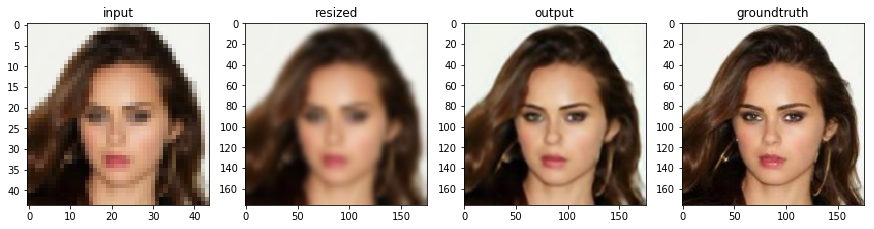

# Super Resolution

- Enhance low resolution image to high resolution image

**To understand and follow how to work click [Website](https://sophieeunajang.wordpress.com/2021/01/28/super-resolution/)!**  
I debug all error, if you want to see what is going on inside, please visit website and check the difference between original and my code. 

## Dependencies
- Python 3+
- Keras
- numpy
- OpenCV
- scikit-image
- matplotlib (for visualization)
